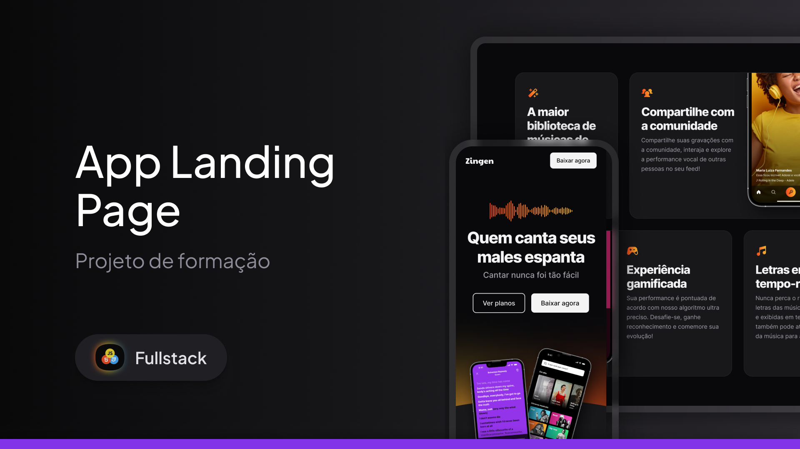

<h1 align="center"> Zingen Karaoke App</h1>

  <a href="#-Technologies">Technologies</a>&nbsp;&nbsp;&nbsp;|&nbsp;&nbsp;&nbsp;
  <a href="#-projeto">Project</a>&nbsp;&nbsp;&nbsp;|&nbsp;&nbsp;&nbsp;
  <a href="#-layout">Layout</a>

 

  

## 🚀 Technologies

This project was developed with the following technologies:

## 💻 Project

Complete and responsive marketing landing page for a Karaoke app called Zingen.

##  Layout

You can view the project layout through [FROM THIS LINK](https://www.figma.com/design/J2vQV6ZxqmUB67RLb4RkLj/LP---Zingen?node-id=0-1&t=BYIUJ6ouAidrCo71-1). It is necessary to have an account on [Figma](https://figma.com) to access it.

 ## 🌍 Deployment

You can access the project directly through Vercel:  
👉 [Zingen - landing page on Vercel](https://zingen-landing-page-swart.vercel.app/)

---

Made by : [Augusto Valerio](https://github.com/Augusto-Valerio).
